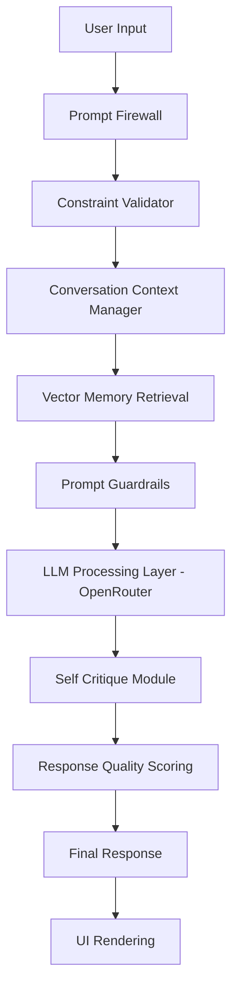
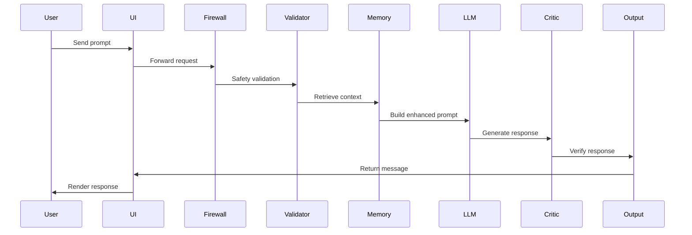
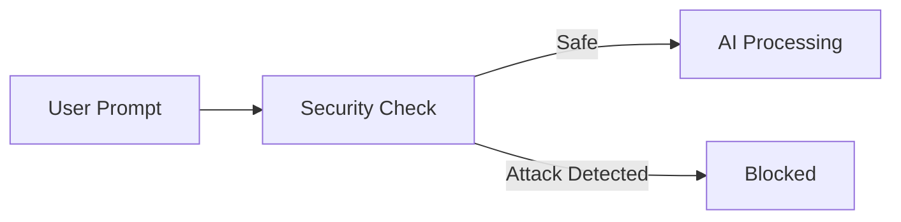
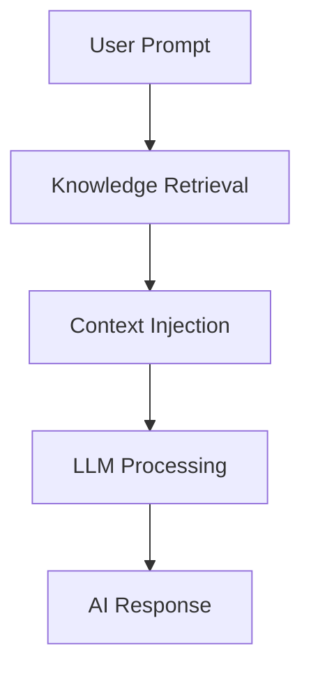
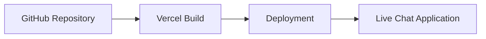

# Mejiaibot — Autonomous LLM Chat System

Mejiaibot is a structured conversational AI system built on top of modern Large Language Models using the OpenRouter API.

Rather than functioning as a simple prompt–response chatbot, Mejiaibot introduces a layered architecture designed to improve reasoning stability, contextual awareness, and response reliability.

The goal is to transform a large language model from a reactive text generator into a controlled conversational reasoning engine capable of handling complex prompts while maintaining logical consistency.

---

# System Overview

Mejiaibot implements a modular AI interaction pipeline designed to enforce structure in LLM-based dialogue systems.



This pipeline ensures prompts pass through safety, validation, and reasoning layers before reaching the AI model.

---

# Core Capabilities

### Context-Aware Conversation Memory
Maintains conversational history across multiple user interactions.

### Structured Reasoning Guardrails
System prompts enforce structured and logical responses.

### Constraint Validation
Detects prompt instructions and ensures they are respected.

### Prompt Injection Protection
Prevents malicious prompts from overriding system instructions.

### Response Verification
Self-checking mechanisms validate responses before display.

### Modular Architecture
Designed for extensibility and AI feature experimentation.

---

# AI Processing Pipeline



---

# Feature Overview

## Conversational Intelligence

• Context-aware multi-turn conversations  
• Structured reasoning prompts  
• Self-verification pipeline  
• Lightweight knowledge retrieval  

---

## User Experience

• Premium dark-mode interface  
• Smooth animated UI interactions  
• Markdown message rendering  
• Syntax-highlighted code blocks  
• One-click code copy buttons  

---

## Interaction Capabilities

• Voice recognition input  
• Persistent chat sessions  
• Chat history stored using localStorage  
• JSON export for conversation logs  

---

## Reliability Systems

• Error Handling 2.0  
• Constraint-aware prompt processing  
• Response scoring system  
• Retry logic for failed responses  

---

# Security Layer

Large language models can be vulnerable to prompt injection and instruction override attacks.

Mejiaibot includes protective mechanisms to mitigate these risks.



### Security Protections

• Prompt injection detection  
• System prompt isolation  
• Instruction override prevention  

---

# Vector Memory Layer

Mejiaibot includes a lightweight knowledge retrieval system inspired by Retrieval Augmented Generation.

Instead of relying entirely on model training data, relevant knowledge entries can be injected into the prompt context.



This allows the system to incorporate structured knowledge when generating responses.

---

# Technology Stack

### Frontend

HTML5  
CSS3  
JavaScript ES6

### AI Infrastructure

OpenRouter API

### Interface Utilities

Markdown renderer  
Syntax highlighting engine  
Clipboard utilities  
JSON export helpers  

---

# Repository Structure

```
mejiaibot/
│
├── index.html
├── style.css
├── main.js
│
├── prompts/
│   └── systemGuardrails.js
│
├── core/
│   └── reasoningModes.js
│
├── security/
│   └── promptFirewall.js
│
├── memory/
│   ├── contextManager.js
│   └── vectorMemory.js
│
├── utils/
│   ├── constraintValidator.js
│   ├── responseScore.js
│   └── retryLogic.js
│
├── logs/
│   └── aiMetrics.js
│
└── benchmarks/
    ├── reasoningTests.json
    ├── jailbreakTests.json
    └── logicBenchmarks.json
```

This modular structure allows the system to expand without major architectural changes.

---

# Deployment

The system is deployed using Vercel.



Every push to the main branch automatically redeploys the application.

---

# Live Demo

https://mejiaibot.vercel.app

---

# Development Philosophy

Large Language Models are powerful but inherently unpredictable without structured control layers.

Common issues include:

• hallucinations  
• instruction drift  
• reasoning breakdown under complex prompts  

Mejiaibot explores how layered architecture can enforce discipline in LLM responses and improve conversational reliability.

---

# Future Roadmap

### Memory Systems
• Vector database integration  
• Long-term knowledge storage  

### AI Agents
• Autonomous tool usage  
• Multi-agent reasoning workflows  

### Knowledge Systems
• Retrieval Augmented Generation pipelines  
• External knowledge connectors  

### Security
• Decentralized identity authentication  
• Secure AI interaction layers  

### Evaluation
• AI reasoning benchmarks  
• Prompt attack testing  
• Performance analytics  

---

# Experimental Status

This project is experimental and designed as a sandbox for exploring advanced conversational AI architectures.

---

# Contributions

Contributions are welcome in areas such as:

• AI architecture improvements  
• prompt safety research  
• UI and UX enhancements  
• performance optimization  
• AI benchmarking  

---

# Author

Developed as part of ongoing exploration into building structured and resilient conversational AI systems.
